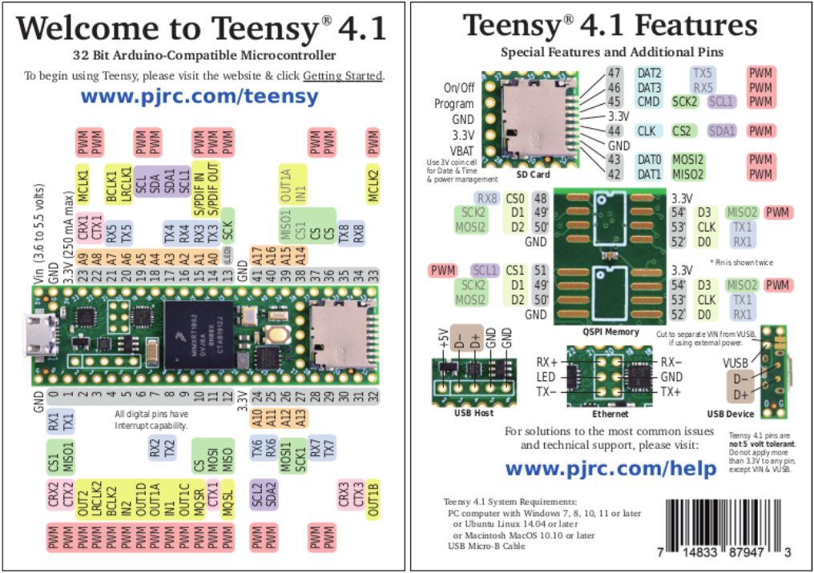
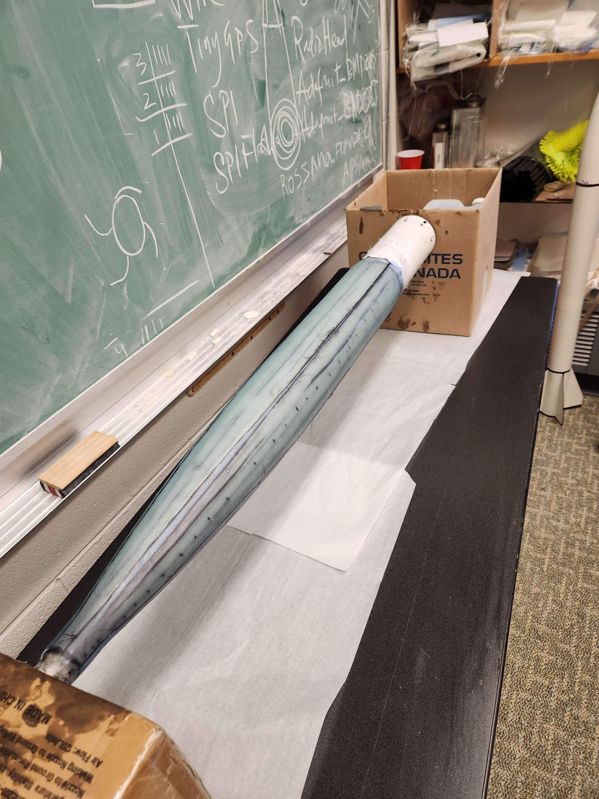
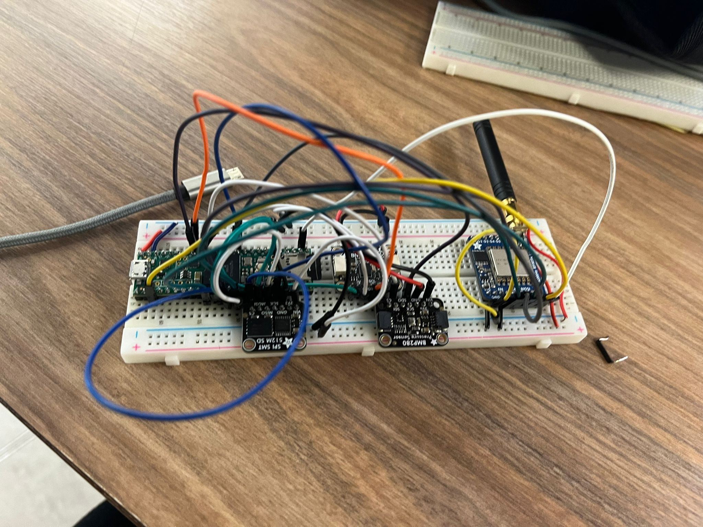
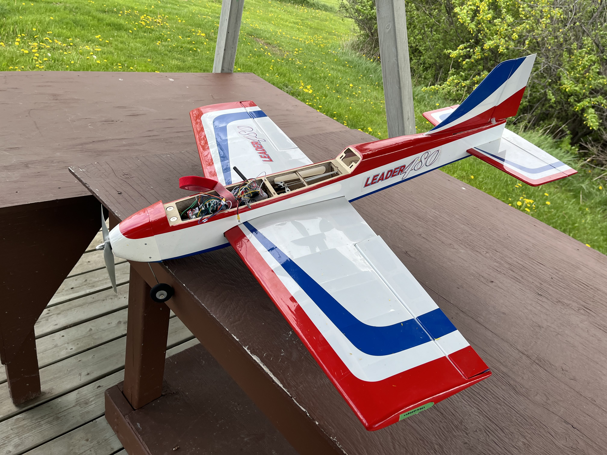

# The Arbalest Flight Computer for our 2 Stage High Power Rocket set to launch at Launch Canada 2024 

This repository contains the code and documentation for the flight computer used in our 2 stage rocket project.

# Components
- Microcontroller: [Teensy 4.1](https://www.pjrc.com/store/teensy41.html)
  

  

- Sensors:
  - Altimeter: [Adafruit BMP280](https://www.adafruit.com/product/2651)
  - IMU (Inertial Measurement Unit): [Adafruit BNO055](https://www.adafruit.com/product/4646)
  - GPS Module: [SparkFun GNSS Receiver Breakout - MAX-M10S (Qwiic)](https://www.sparkfun.com/products/18037)
- Communication: [Adafruit LoRa RFM9X](https://www.adafruit.com/product/3072)
- Our COTS (Commercial Off-The-Shelf) Flight Computer: [Featherweight Blue Raven](https://www.featherweightaltimeters.com/blue-raven-altimeter.html)
(left)
- Our COTS GPS: [Featherweight GPS Tracker](https://www.featherweightaltimeters.com/featherweight-gps-tracker.html) (right)

  
  

# Electronics Mount CAD Design
The electronics mount CAD design showcases the placement of PCBs within the rocket's fuselage. This design ensures proper integration and protection of the flight computer and associated components.

  
  
  

> **Credits:**
> Design done by Caelan Babenko.

# Nosecone (in construction) & Fuselage Housing for the Electronics Mount

  

> **Credits:**
> Nosecone rolled by Sean Hwang, Caelan Babenko, Jordan Birley  
> Fuselage Housing CAD design by Caelan Babenko

# Testing Setup
Here's an image showing my testing setup for the flight computer(left) and ground station(right):

  
  

## On one board 

  

# PCB Schematics
Pictures showing our current **Arbalest Flight Computer** schematics layout

  

  
  
  

> **Credits:**
> PCB design done by Baseer Yousufzai.

# How it works 
Simple Illustration 

  

# Transceiver Test w/ RC plane

  
  
  
  

# To Infinity and Beyond

  
  

