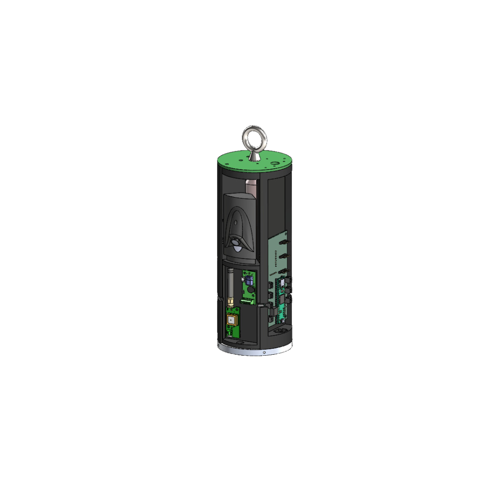
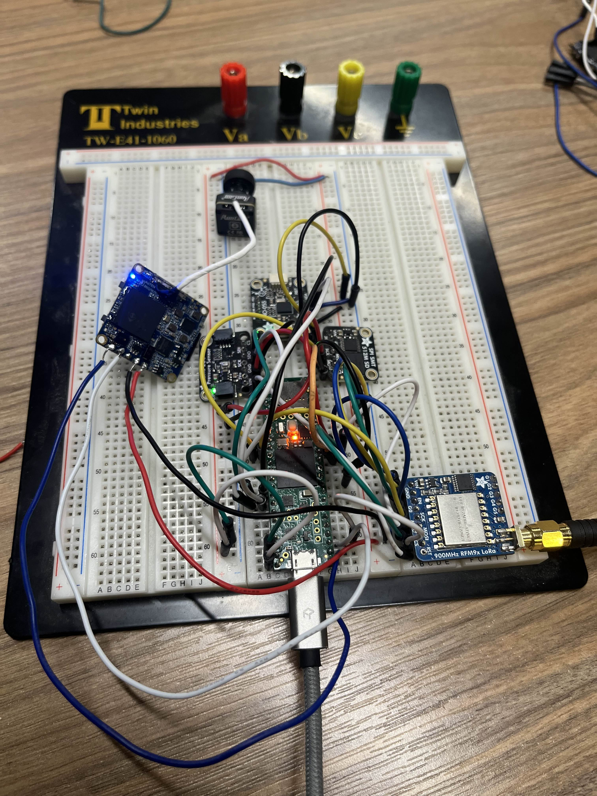

# The Arbalest Flight Computer Software by `Leroy Musa`

This repository contains the code and documentation for the flight computer used for our 2 Stage High Power Rocket set to launch at Launch Canada 2024 

## Components
- Microcontroller: [Teensy 4.1](https://www.pjrc.com/store/teensy41.html)
- Sensors:
  - Altimeter: [Adafruit BMP280](https://www.adafruit.com/product/2651)
  - IMU (Inertial Measurement Unit): [Adafruit BNO055](https://www.adafruit.com/product/4646)
  - GPS Module: [SparkFun GNSS Receiver Breakout - MAX-M10S (Qwiic)](https://www.sparkfun.com/products/18037)
- Communication: [Adafruit LoRa RFM9X](https://www.adafruit.com/product/3072)
- Our COTS (Commercial Off-The-Shelf) Flight Computer: [Featherweight Blue Raven](https://www.featherweightaltimeters.com/blue-raven-altimeter.html)
(left)
- Our COTS GPS: [Featherweight GPS Tracker](https://www.featherweightaltimeters.com/featherweight-gps-tracker.html) (right)

  
  

## Electronics Mount CAD Design by `Caelan Babenko`
The electronics mount CAD design showcases the placement of PCBs within the rocket's fuselage. This design ensures proper integration and protection of the flight computer and associated components.

  
  
  

## Testing Setup
Here's an image showing my testing setup for the flight computer(left) and ground station(right):

  
  

## PCBv1.0 Schematics by `Baseer Yousufzai`
Pictures showing our current **Arbalest Flight Computer** schematics layout

  

  
  
  

## IRLv1.0

  
  

## How it works 
Simple Illustration 

  

## Arbalest Flight Computer Integration Guide

### Overview

This document provides a detailed description of the Arbalest Flight Computer setup as depicted in the provided schematic. The system integrates four 3.7V 650mAh LiPo batteries, a screw switch, and three Runcam Split 4 cameras connected to the Arbalest Flight Computer. The flight computer controls four pyro channels specifically designed for parachute deployment.

### Components

1. **Arbalest Flight Computer**
2. **3.7V 650mAh LiPo Batteries (4x)**
3. **Screw Switch**
4. **Runcam Split 4 Cameras (3x)**
5. **Pyro Channels (4x) for Parachute Deployment**

### Wiring Diagram

The wiring diagram consists of the following connections:
- Power supply wiring from the batteries
- Activation switch wiring
- Camera connections
- Pyro channel connections for parachute deployment

### Power Supply

The power supply section is crucial for powering the flight computer and the connected components.

1. **LiPo Batteries:**
   - Four 3.7V 650mAh LiPo batteries are wired in series-parallel to form a 7.4V 1950mAh power pack.
   - **Series Connection:** Two pairs of two batteries connected in series, resulting in two 7.4V packs.
   - **Parallel Connection:** These two 7.4V packs are connected in parallel to increase the capacity to 1950mAh.

2. **Wiring:**
   - The positive terminal of the first battery is connected to the positive terminal of the second battery.
   - The negative terminal of the second battery is connected to the positive terminal of the third battery.
   - The negative terminal of the third battery is connected to the positive terminal of the fourth battery.
   - The negative terminal of the fourth battery is connected back to the system ground.

3. **Screw Switch:**
   - The main power from the batteries is routed through a screw switch to control the power supply to the entire system.
   - The positive wire from the battery pack connects to one terminal of the screw switch.
   - The other terminal of the screw switch connects to the power input of the Arbalest Flight Computer.

### Pyro Channels for Parachute Deployment

The flight computer controls four pyro channels for parachute deployment.

1. **Connections:**
   - Each pyro channel (1 to 4) has two wires: one connected to the flight computer and the other to the pyro device.
   - The flight computer sends a signal through these wires to activate the pyrotechnic devices.

## Conclusion

The integration of the Arbalest Flight Computer with the LiPo batteries, screw switch, Runcam Split 4 cameras, and pyro channels provides a robust system for managing various flight operations, including parachute deployment. 

# Connecting Runcam Split 4 Cameras to the Testing Setup

To simulate real-flight conditions and verify the functionality of the Runcam Split 4 cameras, a direct connection to the testing setup is essential. This section outlines the straightforward process of integrating Runcam Split 4 cameras into your testing environment for video recording and analysis.

  
  
  

### Step 1: Gather Necessary Components

Ensure you have the following components ready:

- Runcam Split 4 camera module
- Teensy 4.1 microcontroller board
- Jumper wires
- Soldering equipment

### Step 2: Physical Connection

1. **Connect Power**: Use jumper wires to connect the power source to the Teensy 4.1 for providing power to the entire setup.
2. **Connect Camera**: Solder jumper wires onto the RX (receive) and TX (transmit) pins of the Runcam Split 4 camera. Then, connect the RX wire to the RX pin and the TX wire to the TX pin on the Teensy 4.1 for video data transmission.
3. **Ground Connection**: Connect another jumper wire from the ground (GND) pin of the Runcam Split 4 to any ground pin on the Teensy 4.1 to complete the circuit.

# Transceiver Test w/ RC plane

  
  
  

# To Infinity and Beyond

  
  

