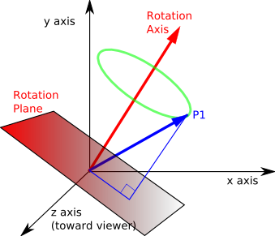
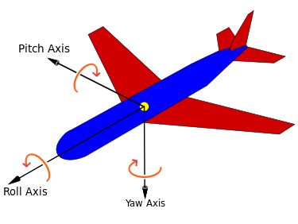

# Rocket Orientation Representation

## Euler Angles vs Quaternions

### Why Convert from Euler Angles to Quaternions?

Euler angles are commonly used to represent rotations in 3D space, but they suffer from gimbal lock and can have issues with interpolation. Quaternions offer a more robust and efficient alternative for representing rotations. Here’s why we convert from Euler angles to quaternions:

- **Gimbal Lock**: Euler angles can experience gimbal lock, where certain orientations lose a degree of freedom. This can lead to unexpected behavior, especially in aerospace applications.
  
- **Smooth Interpolation**: Quaternions provide smooth interpolation between orientations, which is crucial for animations and real-time simulations.

- **Efficiency**: Quaternions are more efficient for numerical integration and rotation operations compared to Euler angles.

### Euler Angles vs Quaternions: Visual Comparison

Below are visual comparisons showing the differences between using Euler angles and quaternions for representing rocket orientations:

  
  

### YouTube Video

To learn more about visualizing quaternions using stereographic projection, watch the following YouTube video:

[Visualizing quaternions with stereographic projection](https://www.youtube.com/watch?v=d4EgbgTm0Bg)

